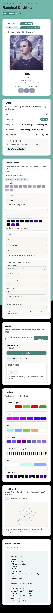

# NanoViz

A Raspberry Pi AirPlay receiver that lights up your Nanoleaf panels in time with
the music. Stream from any iOS/macOS device, and your Shapes / Canvas /
Elements / Light Panels become a reactive visualizer driven by what's playing.



The Pi runs a single container that bundles `shairport-sync` (AirPlay 2 via
`nqptp`), the audio visualizer, and a web control panel. Pair your Nanoleaf
device from the browser, then play to the AirPlay receiver — that's it.

> **Note:** This is a fork of the original audioleaf that pivoted from a
> terminal-only macOS tool into a Pi-first AirPlay appliance with a web UI.
> Most of the original TUI features (keybinds, dump commands, native GUI) have
> been replaced by the web app. See [CHANGELOG.md](CHANGELOG.md) for history.

## Features

- **AirPlay 2 receiver** — Stream from any Apple device; appears as a regular
  AirPlay target on your network.
- **Volume slider drives brightness** — The iOS/macOS volume slider dims and
  brightens your panels. Audio stays at full volume; only the lights move.
- **Three visualizer effects** — Spectrum (bass→treble across panels), Energy
  Wave (cascading ripples), and Ripple (transient-driven pulses).
- **Album art palette** — Optionally pull palette colors from the current
  track's cover art instead of a fixed palette.
- **Device palettes** — Use any palette saved as a Nanoleaf "effect" on the
  device itself; no static catalog to maintain.
- **Web UI** — Pair devices, switch effects/palettes, see now-playing, live
  panel preview, and a layout visualizer.
- **Multi-instance** — Run more than one receiver per Pi with `--name=...`.

## Quick start (Raspberry Pi)

One-shot install from a fresh Pi:

```bash
curl -fsSL https://raw.githubusercontent.com/Weekendsuperhero-io/nanoviz/main/pi/setup.sh \
  | sudo bash
```

Or from a local clone:

```bash
sudo ./pi/setup.sh
```

The installer:

1. Installs `podman` and the `snd-aloop` kernel module.
2. Adds your user to `audio`, `render`, and `systemd-journal` groups.
3. Stages `~/<USER>/.config/nanoviz/` (config + compose file).
4. Drops a Quadlet at `/etc/containers/systemd/nanoviz.container` and
   starts `nanoviz.service`.
5. Installs a polkit rule so the `audio` group can `systemctl start/stop/restart`
   without sudo.

After install:

- Web UI: `http://<pi-ip>:8787`
- Pair your Nanoleaf from the **Devices → Pair new device** card.
- AirPlay to the receiver (default name **nanoviz**).
- Log out and back in once if the script added you to new groups.

### Install flags

```
--name=NAME           Instance name (default "nanoviz"). Controls the
                      systemd unit, container name, Quadlet filename,
                      polkit rule, and config dir. Use a distinct name to
                      run multiple receivers on one host.
--airplay-name=NAME   AirPlay display name advertised on mDNS (the name
                      that appears in the iOS/macOS AirPlay picker).
                      Spaces are allowed; quote the value.
--image-tag=TAG       Container image tag (default: "dev" on non-main git
                      branches, "latest" otherwise).
--config-dir=DIR      Override the default config dir
                      (~/.config/<name> for sudo'd users,
                      /etc/<name> for raw-root installs).
--no-systemd          Skip the systemd unit; just `podman compose up -d`.
--no-deploy           Host prep only — don't pull or start the container.
--force-compose       Overwrite the staged compose.yaml if it exists.
```

Example — second receiver named "Bedroom":

```bash
sudo ./pi/setup.sh --name=nanoviz-bedroom --airplay-name="Bedroom Speaker"
```

### Updating

```bash
sudo podman pull ghcr.io/weekendsuperhero-io/nanoviz:latest
sudo systemctl restart nanoviz
```

(or `:dev` if you installed from a non-`main` branch).

### Uninstall

```bash
sudo ./pi/uninstall.sh                                  # keep config
sudo ./pi/uninstall.sh --purge --remove-image           # full wipe
sudo ./pi/uninstall.sh --name=nanoviz-bedroom         # named instance
```

Removes the systemd service, Quadlet, container, and polkit rule.
`~/.config/<name>/` (with your `nl_devices.toml` pairing tokens) is kept
unless you pass `--purge`.

## Daily use

1. Open the AirPlay menu on your iPhone / Mac and pick **nanoviz** (or
   whatever you set via `--airplay-name`).
2. Start playback. Panels react.
3. Slide the volume bar on iOS/macOS — panel **brightness** tracks the
   slider. Audio playback volume is unaffected. Full details under
   [Brightness](#brightness).
4. Open `http://<pi-ip>:8787` to change effect, palette, sort axis, or
   audio sensitivity (`default_gain`) at runtime.

### Visualizer effects

- **Spectrum** — Each panel tracks a frequency band. Bass on one end,
  treble on the other.
- **Energy Wave** — Per-panel band like Spectrum, but brightness cascades
  across the layout as a traveling wave.
- **Ripple** — All panels pulse together, driven by audio transients.

### Color source

Pick one in the web UI:

- **Palette** — Use a named palette stored as an effect on your Nanoleaf
  device. The dropdown lists every palette the device knows about and
  shows the swatches inline.
- **Artwork** — Extract colors from the current track's cover art. Falls
  back to the configured palette when nothing's playing.

### Brightness

Panel brightness is driven by the **AirPlay volume slider** on the
streaming device (iPhone Control Center, macOS menu-bar volume, the
volume slider in any AirPlay-aware app). Slide it up — panels get
brighter; slide it down — panels dim.

- **Audio is not affected.** The shipped `shairport-sync.conf` sets
  `ignore_volume_control = "yes"`, so AirPlay volume events update
  panel brightness only. Music stays at full volume the whole time. If
  you want lower playback volume, use your speaker / amp's own volume,
  not the AirPlay slider.
- **Mapping.** `0 dB` (slider at the top) → brightness `100`; `-30 dB`
  (slider at the bottom) → brightness `1`; linear in between. Tapping
  **Mute** holds the current brightness rather than darkening the panels
  (so a stray mute press doesn't kill the lights).
- **Manual override in the web UI.** The brightness slider on each
  device card in the web UI still works — set any value you like. The
  next AirPlay volume event will take control again. This is intentional:
  the AirPlay slider is the "live" knob; the web slider is for one-off
  adjustments when nothing's playing.
- **Connection behavior.** On AirPlay connect, the panels keep whatever
  brightness they had before; brightness only changes when the slider
  actually moves. (Previously the panels jumped to 100 on every connect.)
- **`default_gain` is a separate knob.** It controls audio analysis
  sensitivity (how loud the FFT input has to be before the visualizer
  swings full-range), *not* panel brightness. Set it once and forget;
  the volume slider is what you reach for daily.

If you'd rather wire a different control to brightness, the underlying
endpoint is `PUT /api/devices/{name}/state` with `{"brightness": 0-100}`.

## Configuration

Config lives in `~/.config/<instance>/config/config.toml` on the host
(bind-mounted into the container as `/root/.config/nanoviz/`). The web
UI edits the running config in memory; click **Save** to persist.

### Example `config.toml`

```toml
default_nl_device_name = "Shapes AC01"

[visualizer_config]
audio_backend = "default"        # ALSA loopback on the Pi
freq_range = [20, 4500]
color_source = "palette"          # "palette" or "artwork"
palette_name = "Sunset"           # any palette name saved on the device
default_gain = 1.0
transition_time = 2               # in 100ms units
time_window = 0.1875
primary_axis = "Y"                # "X" or "Y"
sort_primary = "Asc"              # "Asc" or "Desc"
sort_secondary = "Asc"
effect = "Spectrum"               # "Spectrum" | "EnergyWave" | "Ripple"
```

### Devices file

`nl_devices.toml` (next to `config.toml`) holds your Nanoleaf pairing
tokens. The web UI writes this automatically when you pair from the
**Devices** card. Keep it backed up if you reinstall.

## HTTP API

The container exposes a REST + WebSocket API on port `8787`. Selected
routes:

- `GET  /api/health` — version + the configured AirPlay name
- `GET  /api/config` — current runtime config
- `POST /api/config/save` — persist runtime config to `config.toml`
- `PUT  /api/config/visualizer/{effect,palette,color-source,sort,settings}`
- `GET  /api/now-playing` — current track + AirPlay volume
- `GET  /api/now-playing/artwork` — current cover art bytes
- `GET  /api/visualizer/{preview,status}` and `WS /api/visualizer/ws`
- `GET  /api/palettes` — palettes from the active device
- `GET  /api/audio/backends`
- `GET  /api/devices`, `POST /api/devices/discover`,
  `POST /api/devices/pair`
- `GET  /api/devices/{name}/info`, `/layout`
- `PUT  /api/devices/{name}/state` — manual power / brightness override

## Running outside the container (development)

The repo builds and runs as a regular Rust binary plus a Vite frontend.
Useful on macOS or Linux dev machines where you don't want to deal with
the container.

```bash
# 1. Build the frontend
cd web && pnpm install && pnpm build && cd ..

# 2. Run the API + visualizer
cargo run --bin nanoviz
```

Then visit `http://127.0.0.1:8787`.

Useful flags:

- `--host 0.0.0.0` — bind interface (default `0.0.0.0`).
- `--port 8787` — HTTP port.
- `--config /path/to/config.toml`
- `--devices /path/to/nl_devices.toml`
- `NANOVIZ_FRONTEND_DIR=/path/to/web/dist` — serve a different build.
- `NANOVIZ_AIRPLAY_NAME="Living Room"` — override AirPlay name (also
  surfaced in the web UI header).

For the Vite dev server with hot reload:

```bash
cd web && pnpm dev    # http://127.0.0.1:5173 (proxies /api → 8787)
```

### macOS audio capture

The CoreAudio backend can't intercept system audio without a loopback
device.

1. Install [BlackHole](https://existential.audio/blackhole/) (free).
2. **Audio MIDI Setup** → Multi-Output Device with your speakers +
   BlackHole 2ch; set as system output.
3. In the web UI, switch the audio backend to `BlackHole 2ch`.

### Linux audio capture (dev mode)

In `pavucontrol` → **Recording** tab, point nanoviz at your player's
monitor source. Pick the matching backend in the web UI.

## Troubleshooting

- **AirPlay name keeps incrementing (`nanoviz #2`, `#3`, ...)** — A
  stale mDNS registration is cached on the host's avahi-daemon. Run
  `sudo systemctl restart avahi-daemon` once. See
  [DEBUG.md](DEBUG.md#avahi-name-collision-renaming-to-name-n-loop).
- **Web UI says "No known devices yet"** — Click **Pair new device →
  Scan network**, hold the Nanoleaf power button until the LEDs flash,
  then click **Pair**.
- **Panels don't react** — Check the visualizer status badge in the web
  UI; if it's `Restarting`, the audio backend may be missing.
  `default_gain` controls audio sensitivity; bump it in the web UI.
- **Container won't start with "Unit is transient or generated"** —
  Older installs; pull the latest `pi/setup.sh`. The Quadlet generator
  wires `[Install] WantedBy=` itself; never call `systemctl enable` on
  it.

## Contributing

Issues and PRs welcome. Run `cargo clippy --bin nanoviz -- -D warnings`
and `pnpm build` (in `web/`) before sending.

## Credits

NanoViz is a fork of [**audioleaf**](https://github.com/alfazet/audioleaf)
by **Antoni Zasada**, which provided the original Nanoleaf SSDP discovery,
ALSA audio capture, FFT analysis, panel sorting/layout, and palette
visualizer effects. The rename to NanoViz coincided with the shift from a
terminal-only macOS tool to a Pi-first AirPlay appliance with a web UI
(AirPlay 2 via shairport-sync + nqptp, podman/Quadlet deployment,
web-based device pairing, album-art palette extraction, AirPlay-volume
brightness, and the React control panel).

See [NOTICE](NOTICE) for the fork lineage and third-party component
attributions. MIT licensed; see [LICENSE](LICENSE).
